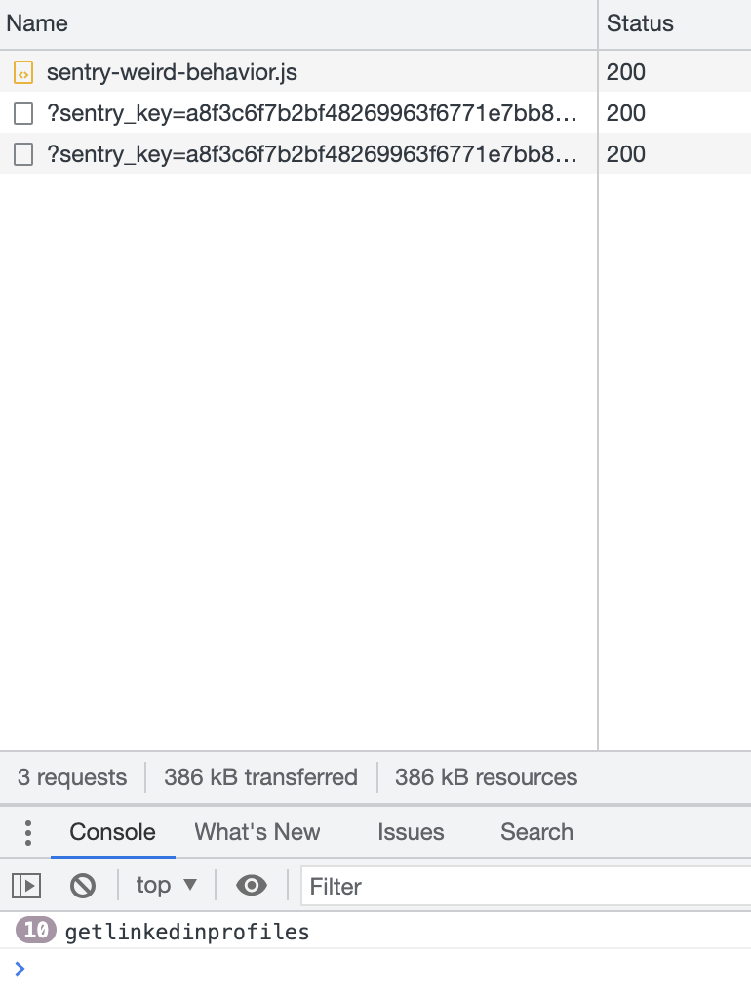

# different message
with code
```javascript
Sentry.captureMessage('jso'+i++)
```
we see in network:


we see in sentry :


# same message
with code
```javascript
Sentry.captureMessage('jso')
```
we see in network:


we see in sentry :


I am expecting to receive 10 message and not only one event of type default...

